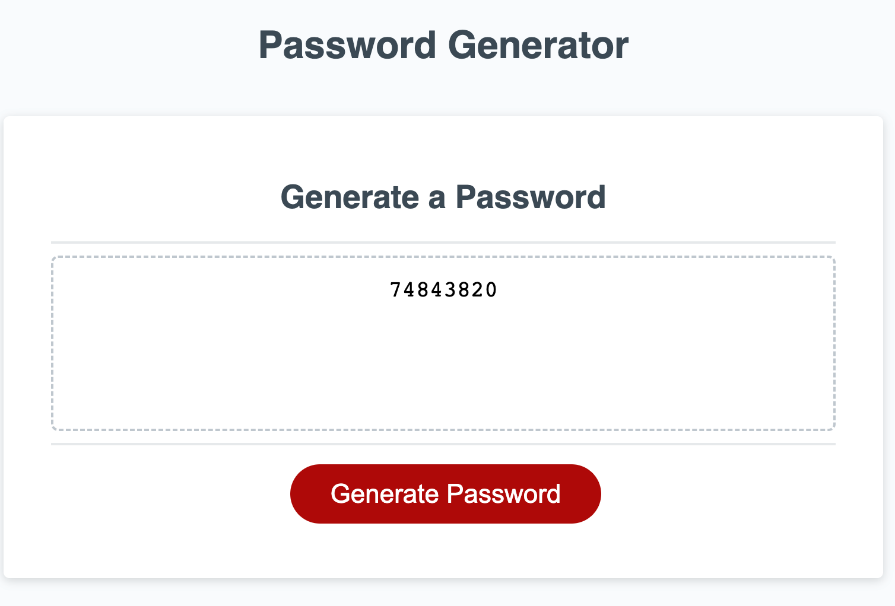

# Password Generator using JavaScript
#
Module 3 Assignment

## Description
This project began by modifying starter code to create an application that enables employees to generate random passwords based on criteria that they’ve selected. This app is designed to run in the browser and features dynamically updated HTML and CSS powered by JavaScript code. It has a clean and polished, responsive user interface that adapts to multiple screen sizes.

Solving the problems of this project taught me to understand better the relationships between variables and functions in JavaScript, as well as ways to reference components of the HTML code.

Link to deployed site here: https://wendywilgus.github.io/Password-Generator/

## Table of Contents

- [Languages Used](#languages)
- [Mockup](#mockup)
- [Credits](#credits)
- [Resources](#resources)

## Languages Used
The following languages were used to create this project:

-HTML

-CSS

-JavaScript

## Mockup

The following image was the original design provided.. 

Here is an example of the final product, showing a generated 

## Credits

This project was completed as part of Georgia Tech's Full Stack Development Boot Camp course. 
© 2022 Trilogy Education Services, LLC, a 2U, Inc. brand. Confidential and Proprietary. All Rights Reserved.

## Resources

The following resources were helpful in researching best practices and problem-solving on the project.

- Special Characters <https://www.owasp.org/index.php/Password_special_characters>

-JavaScript Functions <https://www.w3schools.com/js/js_functions.asp>

-JavaScript Variables <https://developer.mozilla.org/en-US/docs/Web/JavaScript/Reference/Statements/var>

-JavaScript Expressions & Operators <https://developer.mozilla.org/en-US/docs/Web/JavaScript/Guide/Expressions_and_Operators>
